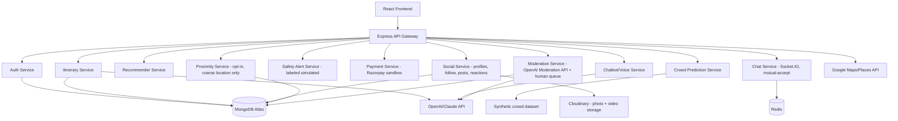

# Darshan — Project Design Document (PDD) v3

**Version:** 3.0 (Pre-Implementation) — full-year scope, supersedes v2
**Schedule assumption:** alternating days with NoZone AI, 3 hrs/session, ~9 hrs/week, over a 12-month (52-week) window
**Planned build duration:** 35 of the available 52 weeks (~315 hours) — the remaining ~17 weeks are intentional slack, not unscheduled time

---

## A Note on "Perfect" and "A Full Year"

More time resolves some risks and not others, and treating all of them as solved by a longer calendar would be a worse document, not a better one. This version is organized around a clear rule:

- **Time-limited constraints get upgraded** (deeper testing, video support, buffer around hard milestones, real content-moderation API, a genuine attempt at temple-partnership outreach).
- **Access-limited constraints stay fixed** — NDTM and IRCTC have no public developer program regardless of how long you wait; that doesn't change with a longer timeline.
- **Principle-limited constraints stay fixed** — the proximity feature's coarse-location-only rule isn't a corner cut made under time pressure, it's a permanent safety design decision. A year doesn't make sharing a stranger's exact location safer.

Each section below flags which category it falls into where relevant.

---

## 1. Problem Statement (Real-World Motivation)

Unchanged from v2: Indian travel planning is fragmented across booking-first OTAs, static review sites, and government portals — none of which capture hyperlocal, current, lived knowledge. A person who actually lives near the Chandrashila trek knows today whether Tungnath's gate is open, how much snow is on the route, and the cheapest real way there. Darshan combines AI-personalized planning with a creator layer that surfaces exactly that kind of knowledge, plus safety-first real-time traveler matching.

---

## 2. Objectives and Success Metrics

| Objective | Success Metric |
|---|---|
| AI itinerary generation | Structured, editable multi-day plan from LLM + fallback algorithm |
| Crowd prediction | Real trained model on labeled synthetic data, RMSE/accuracy reported honestly |
| Multilingual chatbot + voice | Functional in English + Hindi + 1 more; voice I/O working in-browser |
| Creator profiles & content | Follow system, blog/photo/**video** posts, zone tagging, all functional |
| Reactions | Bloom / Pollinate / Root, each behaviorally distinct |
| Real-time proximity matching | All 5 safety non-negotiables implemented and independently demonstrable |
| Content moderation | Real moderation API integrated (not just a keyword filter), with human-review escalation |
| Sponsored posts | Clear labeling; Razorpay sandbox payment flow |
| **Beta validation (new)** | At least 10-15 real test users (classmates/friends) complete a full itinerary-to-post cycle; feedback logged and at least the top 3 issues addressed before v1.0 |
| **Temple partnership attempt (new, non-blocking)** | At least one genuine outreach attempt logged (email/call), outcome documented honestly either way — success becomes a real differentiator, "no reply" becomes a legitimate interview story about resourcefulness under constraint |
| Deployed demo | Publicly accessible, usable without setup |
| Interview-readiness | Rehearsed, honest answers on every simulated component, every safety decision, and the temple-outreach outcome |

---

## 3. Target Users

Unchanged from v2: independent/pilgrimage travelers, local experts/aspiring creators, solo travelers seeking real-time companionship, local businesses, and recruiters/interviewers.

---

## 4. Current Solutions and Their Limitations

Unchanged from v2 — see prior competitive analysis (preserved in `docs/research/competitive-analysis.md`). No new competitor category emerges from having more time; the differentiation argument doesn't change with schedule length.

---

## 5. Functional Requirements (Full List, v3)

### Core planning (unchanged from v2)
FR1-FR10: Auth, POI search, AI itinerary generation, manual editing, recommender, crowd prediction, safety alerts, payments (sandbox), offline caching, admin analytics.

### Language & assistant (unchanged from v2)
FR11-FR14: Multilingual chatbot, voice input/output, auto-translation.

### Creator / social layer (updated)
| ID | Requirement |
|---|---|
| FR15-FR21 | Unchanged from v2: profile, follow, blog posts, zone tagging, feed filtering, reactions, promoted posts |
| **FR28 (new)** | **Video posts** — upload via Cloudinary video, with a reasonable duration cap (e.g., 60-90 seconds) to control storage/bandwidth cost |
| **FR29 (new)** | **Real content moderation**: every post (text, photo, video) passes through an automated moderation check (OpenAI Moderation API — free, self-serve, real) before publishing; flagged content routes to a human-review queue rather than auto-publishing or auto-rejecting |

### Real-time proximity matching (unchanged from v2 — principle-fixed, not time-fixed)
FR22-FR27: unchanged. See NFR7-10 below — these do not loosen with more time.

## 6. Non-Functional Requirements (Full List, v3)

| ID | Requirement | Category |
|---|---|---|
| NFR1-NFR6 | Unchanged from v2 (simulated-data labeling, DPDP consent, bcrypt/JWT/HTTPS, config-driven, CI, mobile-responsive) | — |
| NFR7-NFR10 | Unchanged from v2 — proximity opt-in only, coarse location only, mutual-accept chat, block/report on day one | **Principle-fixed: does not change with more time** |
| **NFR11 (upgraded)** | Content moderation now uses a real moderation API (OpenAI Moderation endpoint) plus human-review escalation, not just a keyword filter | Time-limited: upgraded now that there's room |
| NFR12 | Sponsored posts visually distinguishable everywhere | Unchanged |
| **NFR13 (new)** | Video uploads are size/duration capped and transcoded to a single standard format/resolution on upload, to bound storage cost | Time-limited: added now that video is in scope |
| **NFR14 (new)** | A documented incident-response process exists for reports filed through the block/report system — response time target, escalation path — even if the "team" responding is just you during the build phase | Principle-fixed: a report button without a defined response process is a facade, regardless of timeline |

---

## 7. Security Threat Model (New Section)

Adding real-time chat and proximity matching introduces real attack surface. A brief, honest threat model:

| Threat | Mitigation |
|---|---|
| Fake profile used to lure a solo traveler | Report/block on day one (NFR10); rate-limit new-account proximity opt-in (e.g., account must be >24hrs old before appearing as "nearby") |
| Location inference via repeated coarse-bucket queries (triangulation) | Rate-limit proximity queries per user; round buckets consistently rather than precise-distance responses |
| Chat abuse/harassment | Report flow feeds the same moderation queue as post content (NFR29); repeated reports trigger account review |
| Fake "promoted" posts used for scams (fake hotel listings) | Sponsored posts require the same moderation pass as organic content, plus manual review before a promoted post goes live (higher bar than organic, since money is involved) |
| JWT theft / session hijacking | Short-lived tokens, HTTPS-only, standard practice already in NFR3 |

This isn't a formal enterprise threat model — it's the honest, appropriately-scoped version for a solo-built social feature, and it's genuinely more thorough than most student projects attempt, which is itself worth saying explicitly in an interview.

---

## 8. Ethical AI & Bias Considerations (New Section, adapted from original research)

- **LLM hallucination on sacred/cultural content**: itinerary and chatbot outputs about temples, festivals, or religious practices must not present unverified claims as fact. Mitigation: system-prompt constraints instructing the model to flag uncertainty rather than fabricate specifics (timings, rituals), and a visible "AI-generated, verify locally" disclaimer on itinerary output.
- **Recommendation bias**: content-based recommenders tend to over-surface already-popular places. Mitigation: deliberately include a "hidden gems" surfacing mechanism in the recommender rather than pure popularity-weighting — ties directly back to the project's own hyperlocal-knowledge thesis.
- **Language equity**: multilingual support should not be English-first with other languages as an afterthought — chatbot and translation quality should be spot-checked in Hindi (and the third language chosen) with the same rigor as English, not just "does it technically respond."

---

## 9. High-Level System Architecture



---

## 10. Technology Stack (Additions in v3)

| Technology | Choice | Why |
|---|---|---|
| Content moderation | OpenAI Moderation API | Real, free, self-serve — genuinely available, unlike NDTM/IRCTC, so there's no reason to fake this one even under time pressure |
| Video handling | Cloudinary video (with duration/size caps) | Same provider as photos, avoids adding a second vendor |

All other stack choices unchanged from v2.

---

## 11. Data Schema (Additions in v3)

| Collection | New/Changed Fields |
|---|---|
| **Post** | add `videoURL (optional)`, `moderationStatus (pending/approved/flagged)` |
| **Report** | add `escalated (bool)`, `resolutionNotes`, `resolvedAt` |
| **PartnershipOutreach (new)** | `orgName, contactMethod, dateSent, status (no-reply/declined/accepted), notes` — tracks the temple-partnership attempt honestly |

---

## 12. Testing Strategy (New Section)

| Level | Approach |
|---|---|
| Unit | Jest for backend services (each service gets tests as it's implemented, not retrofitted at the end) |
| Integration | Supertest for API endpoints; mock external APIs (Google Maps, LLM, Moderation) in CI to avoid cost/flakiness |
| Real-time | Socket.IO client simulation tests for chat/proximity flows, including the mutual-accept requirement specifically |
| Beta testing (new) | 10-15 real users (classmates/friends) run a full cycle: sign up → generate itinerary → post a blog → react → (opt-in) try proximity matching. Feedback logged in a simple form/spreadsheet, top issues triaged before v1.0 |
| Security spot-check | Manually attempt the threat-model scenarios in §7 yourself before calling M12 done — e.g., try to infer another test account's precise location via repeated queries |

---

## 13. Project Timeline and Milestones (Full-Year, v3)

At ~9 hrs/week:

| Milestone | Duration | Deliverable |
|---|---|---|
| M0 — Research & PDD | Done | This document (v3) |
| M1 — Environment & repo | 1 week | ✅ Already scaffolded |
| M2 — Backend core | 2 weeks | Auth, models, core CRUD |
| M3 — Frontend core | 2 weeks | Search, place detail, itinerary skeleton |
| M4 — Maps integration | 1 week | Live Google Places/Maps |
| M5 — AI itinerary generation | 2 weeks | LLM + fallback |
| M6 — Recommender | 1 week | Content-based filtering |
| M7 — Crowd prediction model | 2 weeks | Trained model |
| **Buffer after M7** | 2 weeks | Absorbs the hardest ML milestone running long |
| M8 — Multilingual chatbot + voice | 2 weeks | Chatbot, voice I/O, translation |
| **Buffer after M8** | 1 week | New-tech (Web Speech API) friction absorption |
| M9 — Creator profiles & follow | 2 weeks | Profiles, follow/unfollow |
| M10 — Blog/photo/**video** posts + zones | 3 weeks | Full content creation, incl. video (+1 week vs v2) |
| M11 — Reaction system | 1 week | Bloom / Pollinate / Root |
| M12 — Real-time proximity + chat (safety-first) | 3 weeks | All 5 safety non-negotiables shipped together |
| **Buffer after M12** | 2 weeks | Highest-risk milestone — most likely to need iteration |
| M13 — Sponsored posts + payments | 1 week | Promoted labeling, Razorpay sandbox |
| M14 — Real content moderation | 1 week | OpenAI Moderation API + human-review queue |
| M15 — Beta testing & iteration | 3 weeks | 10-15 real users, feedback triaged and addressed |
| M16 — Testing, docs, deployment | 2 weeks | CI green, docs complete, live deployed demo |
| M17 — Publication & interview prep | 1 week | Resume bullets with real numbers, mock interview |

**Total scheduled: 35 weeks (~315 hours) of the available 52.** The remaining ~17 weeks (~4 months) are deliberately unscheduled — absorbing exam periods, Infosys/placement interview cycles, NoZone AI's own demands on shared bandwidth, and ordinary life, rather than assuming a frictionless year.

**Parallel, non-blocking track:** temple-partnership outreach (email/call attempt) runs alongside M7-M15 — it costs a few hours of drafting and follow-up, not a dedicated milestone, and never blocks the critical path. The synthetic crowd data ships regardless of outcome.

---

## 14. Risk Analysis (Updated — Time-Solvable vs. Fixed)

| Risk | Solved by more time? | Mitigation |
|---|---|---|
| Proximity guardrails cut under deadline pressure | **Yes** | Dedicated buffer after M12 specifically |
| Real-time infra learning curve | **Yes** | Buffer weeks, unhurried first pass |
| Burnout from pace alongside NoZone AI | **Yes** | Explicit unscheduled slack (~4 months), not just a longer deadline |
| Scope creep continues indefinitely | **No — actively watch for this** | This PDD v3 is the third and hopefully final enforced boundary; a v4 conversation should trigger the same honesty check, every time |
| NDTM/IRCTC access | **No** | Stays "designed for, not integrated," permanently, documented as such |
| Proximity feature safety principle erodes ("we have more time, let's show more precise location") | **No — must not change** | NFR7-10 are fixed regardless of schedule; flagged explicitly here so future-you doesn't quietly relax them under a different kind of pressure (e.g., a user complaining coarse location is "annoying") |
| Video storage costs creep | Low-medium | Duration/size caps (NFR13) bound this regardless of timeline |
| Beta testers surface a fundamental design flaw late | Medium | M15 is scheduled with 3 weeks specifically so this is absorbable, not catastrophic |

---

## 15. Future Scope (Phase 2 — Still Not in This Build)

- Real NDTM/IRCTC integration, if public access ever exists
- Real UPI merchant status — **only if you deliberately choose to register a real business entity**; this PDD does not recommend this by default even with a year, since it converts a portfolio project into operating a regulated payments-adjacent business with real tax/compliance obligations
- Precise location sharing — explicitly **not** planned, ever, without a fundamentally different trust/verification system than a solo year-long student project can build
- ML-based image content moderation beyond OpenAI's text/image moderation baseline (e.g., custom-trained classifiers)

---

## 16. Resume Value Proposition (Updated)

Everything from v2, plus: a documented, honest attempt at real-world partnership outreach (regardless of outcome), a real beta-testing cycle with real user feedback incorporated, and a defensible security threat model — this is now closer to how an actual small product team scopes and ships a feature than a typical solo student project, and that engineering maturity is the strongest interview asset the project produces, independent of any single feature.

---

## Appendix: Repository Structure (Additions)

```
Darshan/
├── docs/
│   ├── PDD.md                          ← this document (v3)
│   ├── architecture.md
│   ├── threat-model.md                 ← NEW: expands §7
│   └── research/
│       ├── competitive-analysis.md
│       └── partnership-outreach-log.md ← NEW: tracks temple outreach honestly
├── backend/src/services/moderation/    ← NEW
└── (all other structure unchanged from v2)
```

**Next step:** lock v3, update the scaffolded repo with the new service stub (`moderation/`) and doc files, then begin M1 for real.
