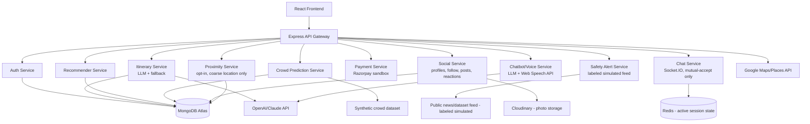

# Darshan — Project Design Document (PDD) v2

**Version:** 2.0 (Pre-Implementation) — supersedes v1, expanded scope confirmed
**Schedule:** Alternating days with NoZone AI, 3 hrs/session, ~3 sessions/week (~9 hrs/week)
**Estimated duration:** ~25 weeks (~225 hours) to a complete, honestly-labeled v1.0
**Change from v1:** adds multilingual chatbot/voice, Instagram-style creator profiles with a blog/photo layer, state-based content zones, a custom reaction taxonomy, and safety-first real-time nearby-traveler matching. Videos remain Phase 2 by the project owner's own call.

---

## 1. Problem Statement (Real-World Motivation)

Indian travel planning is fragmented across booking-first OTAs, review sites, and static government portals — none of which capture the single most valuable kind of travel information: **hyperlocal, current, lived knowledge.** A person who actually lives near the Chandrashekhar Azad (Chandrashila) trek knows today whether the Tungnath temple gate is open, how much snow is actually on the route, and the cheapest real way to get there — information no OTA or map API has, because it isn't a booking or a static POI fact, it's local, current, human knowledge.

**Core problem to solve (expanded):** build a platform that (a) generates AI-personalized, safety-aware itineraries, and (b) surfaces this hyperlocal knowledge by giving local experts and experienced travelers a creator-style presence (profile, followers, blog posts) so beginner or solo travelers can find trustworthy, current, ground-level information — and, distinctively, can find and safely connect with other real travelers near them in real time.

As with v1, this document distinguishes what's genuinely buildable and integrated from what would need real institutional partnerships (government APIs, licensed booking access) that remain out of reach for a student project and stay honestly labeled as simulated.

---

## 2. Objectives and Success Metrics

| Objective | Success Metric |
|---|---|
| AI itinerary generation | Structured, editable multi-day plan from LLM + fallback algorithm |
| Crowd prediction | Real trained model on labeled synthetic data |
| Multilingual chatbot | Functional Q&A assistant, at least 2 languages beyond English (e.g., Hindi + one more) |
| Voice I/O | Working browser-based speech input/output via Web Speech API |
| Creator profiles | Working follow/follower system, profile page with bio + post feed |
| Blog/photo posts | Users can publish text + photo posts, tagged to a state/region zone |
| State zones | Filterable feed by region, showing recent/top posts for that zone |
| Reaction system | Bloom, Pollinate, Root implemented with distinct behaviors (not just three counters) |
| Real-time nearby-traveler matching | Opt-in only; all five safety non-negotiables (below) implemented and demonstrable, not just claimed |
| Sponsored posts | Clear "Promoted" labeling mechanism; Razorpay sandbox flow for a business to "pay" for promotion |
| Deployed demo | Publicly accessible, usable without setup |
| Interview-readiness | Rehearsed, honest answers on every simulated component and every safety design decision |

---

## 3. Target Users

- Independent and pilgrimage travelers (as in v1)
- **Local experts / aspiring travel creators** — people with genuine ground knowledge of a place who want a following and, eventually, promotional income
- **Solo travelers seeking real-time companionship** — the new core differentiator
- Local businesses (homestays, guides, small shops) seeking labeled promotional reach
- Recruiters/interviewers evaluating this as a portfolio piece

---

## 4. Current Solutions and Their Limitations (Updated)

| Platform | Relevant Feature | Limitation Darshan Addresses |
|---|---|---|
| Instagram | Creator profiles, followers, content feed | Not travel-structured; no itinerary, safety, or crowd data attached to content |
| Couchsurfing / Meetup | Real-time/local traveler connection | Not itinerary-integrated; historically criticized for weak safety defaults — Darshan's proximity feature is designed with those lessons in mind from day one |
| TripAdvisor / Tripoto | Travel content, reviews | Static, not creator-economy driven; no real-time matching |
| MakeMyTrip / Yatra | Booking, AI deals | No social/creator layer, no hyperlocal ground-truth content |

**Novel contribution claimed (updated):** the combination of (1) AI-personalized planning, (2) a genuine trained crowd model, (3) a creator economy for hyperlocal travel knowledge, and (4) safety-first real-time traveler matching — no single existing platform combines all four.

---

## 5. Functional Requirements (Full List)

### Core planning (v1, unchanged)
| ID | Requirement |
|---|---|
| FR1 | Auth (signup/login, JWT) |
| FR2 | POI search via Google Places API |
| FR3 | AI itinerary generation (LLM + greedy fallback) |
| FR4 | Manual itinerary editing |
| FR5 | Content-based recommender |
| FR6 | Crowd-level prediction (trained model, synthetic data) |
| FR7 | Safety/scam alerts (public data, labeled simulated) |
| FR8 | Payment flow (Razorpay sandbox) |
| FR9 | Offline caching |
| FR10 | Admin analytics dashboard |

### New: language & assistant
| ID | Requirement |
|---|---|
| FR11 | Multilingual chatbot (LLM-based Q&A, at least English + Hindi + 1 more) |
| FR12 | Voice input (Web Speech API speech-to-text) |
| FR13 | Voice output (Web Speech API text-to-speech) |
| FR14 | Auto-translation of key content (post captions, itinerary text) into user's chosen language |

### New: creator / social layer
| ID | Requirement |
|---|---|
| FR15 | User profile: bio, avatar, follower/following counts |
| FR16 | Follow/unfollow another user |
| FR17 | Create a blog post: text + photo(s) via Cloudinary upload |
| FR18 | Tag a post to a state/region zone |
| FR19 | Browse/filter feed by zone |
| FR20 | React to a post: Bloom (appreciate), Pollinate (reshare to own followers), Root (save/bookmark) |
| FR21 | "Promoted" post type for labeled business sponsorship, with Razorpay sandbox payment demo |

### New: real-time proximity matching (safety-first — see NFRs, non-negotiable)
| ID | Requirement |
|---|---|
| FR22 | Opt-in toggle to appear as "nearby" to other opted-in users |
| FR23 | Nearby list shows coarse proximity only ("within 2km"), never exact coordinates |
| FR24 | Send a chat request to a nearby traveler |
| FR25 | Chat only unlocks after the other party accepts |
| FR26 | Block and report available on every profile and every chat, from the first release |
| FR27 | Location sharing session ends and is not retained once the user opts out or logs off |

## 6. Non-Functional Requirements (Full List)

| ID | Requirement |
|---|---|
| NFR1 | Every simulated data source is labeled in-app and in docs (unchanged from v1) |
| NFR2 | DPDP Act-aligned consent for tracking/analytics (unchanged from v1) |
| NFR3 | bcrypt + short-lived JWT + HTTPS (unchanged from v1) |
| NFR4 | Config-driven, no hardcoded secrets (unchanged from v1) |
| NFR5 | CI runs lint + tests on every PR (unchanged from v1) |
| NFR6 | Mobile-responsive (unchanged from v1) |
| **NFR7** | **Proximity matching is opt-in only — never background or default-on location tracking** |
| **NFR8** | **Exact coordinates are never shown to another user under any circumstance in v1 — only coarse distance buckets** |
| **NFR9** | **Chat visibility requires mutual accept — one-sided visibility into "who's near me" is never exposed as a chat-ready contact** |
| **NFR10** | **Block/report ships in the same release as the proximity feature itself — it is part of the feature's definition of done, not a follow-up task** |
| NFR11 | Baseline content moderation for user posts: a text profanity filter plus a user-reporting flow with manual review — a full ML moderation pipeline is out of scope for a solo student build and is documented honestly as such |
| NFR12 | Sponsored posts are visually distinguishable (badge/label) from organic content in every view, not just on the detail page |

---

## 7. High-Level System Architecture



---

## 8. Technology Stack (Additions to v1)

| Technology | Choice | Why |
|---|---|---|
| Real-time chat/presence | Socket.IO | Same real-time pattern already in your Prodigy internship stack — reinforces a skill you're already building |
| Voice I/O | Web Speech API (browser-native) | Zero-cost, no custom ASR/TTS model needed, works directly in the browser |
| Translation | LLM API (same as itinerary/chatbot) | One provider handles chat, translation, and itinerary generation — simpler than adding a separate translation service |
| Photo storage | Cloudinary | Already used in your Prodigy internship — direct skill transfer |
| Session/presence state | Redis | Standard pairing with Socket.IO for tracking who's currently "opted in" to proximity matching |
| Content moderation (baseline) | Simple profanity-filter library + manual report queue | Honest scope — a full trust-and-safety ML pipeline is not solo-student-buildable, and pretending otherwise would be the same mistake as the original IRCTC/NDTM overreach |

---

## 9. Data Schema Additions

| Collection | Key Fields |
|---|---|
| **Follow** | `followerId, followingId, createdAt` |
| **Post** | `postId, authorId, text, photoURLs[], zoneTag (state/region), isPromoted (bool), createdAt` |
| **Reaction** | `reactionId, postId, userId, type (bloom/pollinate/root), createdAt` |
| **ProximityOptIn** | `userId, isActive (bool), lastActiveTimestamp, coarseLocationBucket` — never stores exact coordinates persistently |
| **ChatRequest** | `requestId, fromUserId, toUserId, status (pending/accepted/declined), createdAt` |
| **ChatSession** | `sessionId, participantIds[], messages: [{senderId, text, timestamp}], active (bool)` |
| **Report** | `reportId, reportedByUserId, targetUserId or targetPostId, reason, status, createdAt` |

---

## 10. Project Timeline and Milestones (Full, v2)

At ~9 hrs/week:

| Milestone | Duration | Deliverable |
|---|---|---|
| M0 — Research & PDD | Done | This document (v2) |
| M1 — Environment & repo | 1 week | MERN scaffold, GitHub structure, CI |
| M2 — Backend core | 2 weeks | Auth, User/Place/Trip models, core CRUD |
| M3 — Frontend core | 2 weeks | Search, place detail, itinerary UI skeleton |
| M4 — Maps integration | 1 week | Live Google Places/Maps |
| M5 — AI itinerary generation | 2 weeks | LLM + fallback, editable output |
| M6 — Recommender | 1 week | Content-based filtering |
| M7 — Crowd prediction model | 2 weeks | Trained model on labeled synthetic data |
| M8 — Multilingual chatbot + voice | 2 weeks | Working chatbot, voice I/O, translation |
| M9 — Creator profiles & follow system | 2 weeks | Profile pages, follow/unfollow |
| M10 — Blog posts + state zones | 2 weeks | Post creation, photo upload, zone tagging/filtering |
| M11 — Reaction system | 1 week | Bloom / Pollinate / Root, each functionally distinct |
| M12 — Real-time proximity + chat (safety-first) | 3 weeks | Opt-in matching, coarse location, mutual-accept chat, block/report — all shipped together |
| M13 — Sponsored posts + payments | 1 week | Promoted label, Razorpay sandbox flow |
| M14 — Testing, docs, deployment | 2 weeks | CI green, README, architecture docs, live demo |
| M15 — Publication & interview prep | 1 week | Resume bullets with real numbers, mock interview covering both the honesty-framing and the safety-design decisions |

**Total: 25 weeks.**

---

## 11. Risk Analysis (Updated)

| Risk | Likelihood | Impact | Mitigation |
|---|---|---|---|
| Proximity feature built without safety guardrails due to time pressure late in the schedule | Medium | Critical | NFR7-10 are part of M12's definition of done — M12 is not "complete" without them, no partial-credit shipping |
| Scope creep continues beyond this v2 | High | High | This PDD is now the second enforced boundary; a v3 conversation should trigger the same timeline-honesty check we just did |
| Content moderation gaps allow abusive posts/messages | Medium | Medium | Baseline profanity filter + mandatory report flow (NFR11) — documented explicitly as MVP-level, not enterprise-grade |
| Real-time infra (Socket.IO + Redis) is new territory | Medium | Medium | Scoped its own 3-week milestone (M12) rather than bolted onto another week — reflects genuine complexity, not optimism |
| 25-week timeline alongside NoZone AI leads to burnout | Medium | High | Already discussed and explicitly accepted; revisit this specific risk at the halfway point (~week 12-13) as a scheduled check-in, not just hoped past |

---

## 12. Future Scope (Phase 2 — Not in This Build)

- Video posts (Cloudinary supports this later without an architecture change)
- Real NDTM/IRCTC/temple-partnership integrations, if access ever materializes
- ML-based content moderation (image/text classifiers) beyond the baseline filter
- Precise (not coarse) location sharing, opt-in per-conversation, once trust/reporting systems have real usage data behind them
- Real UPI merchant status if the project becomes an actual product

---

## 13. Resume Value Proposition (Updated)

- Full-stack breadth: real-time systems (Socket.IO/Redis), social-graph modeling, content moderation basics, payment integration, LLM integration, and a genuinely trained ML model — a wider spread than most single-purpose student projects
- A safety-first design narrative for the proximity feature is a strong, differentiated interview story — most student projects that touch "location + strangers" haven't thought about it at this level, and being able to explain *why* you built it the way you did is worth more than the feature itself
- Demonstrated judgment on scope: two rounds of honestly re-scoping an increasingly ambitious idea, rather than either refusing to grow it or overpromising, is itself a mature engineering story

---

## Appendix: Updated Repository Structure

```
Darshan/
├── docs/
│   ├── PDD.md                          ← this document
│   ├── architecture.md
│   └── research/competitive-analysis.md
├── frontend/src/
├── backend/
│   ├── src/routes/, models/
│   └── src/services/
│       ├── itinerary/
│       ├── recommender/
│       ├── crowd/
│       ├── alerts/
│       ├── social/            ← NEW: profiles, follow, posts, reactions
│       ├── proximity/         ← NEW: opt-in matching, coarse location only
│       └── chat/              ← NEW: Socket.IO handlers
├── ml/crowd_model/
├── tests/
└── .github/workflows/ci.yml
```

**Next step:** lock this v2, then scaffold the repo (same treatment as NoZone AI) and begin M1.
