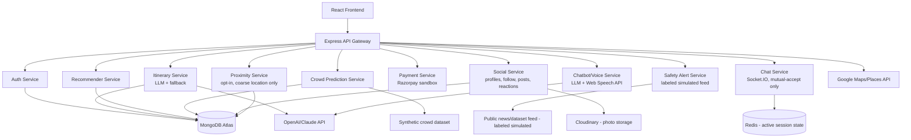

# Architecture

Full context and rationale: see [PDD.md](./PDD.md).

## System Diagram

## Non-Negotiable Safety Design (Proximity Feature)

These are acceptance criteria for Milestone 12, not optional polish:

1. Opt-in only — never background or default-on location tracking
2. Coarse proximity buckets shown ("within 2km") — exact coordinates never exposed to another user
3. Chat unlocks only on mutual accept — no one-sided visibility into chat-ready contacts
4. Block/report ships in the same release as the feature itself
5. No location history retention once a user opts out or logs off

## Design Principles

1. **Honesty over impressiveness**: every simulated data source (crowd feed, safety alerts, NDTM/IRCTC references) is labeled as such in-app and in docs — never presented as live institutional integration.
2. **Config-driven, not hardcoded**: API keys, thresholds, and feature flags live in environment config, not inline in code.
3. **Modular services**: itinerary, recommender, crowd, alerts, social, proximity, and chat are independently developed and testable services behind a single API gateway.
